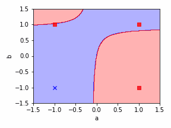
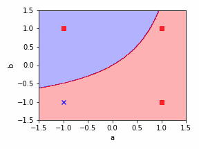
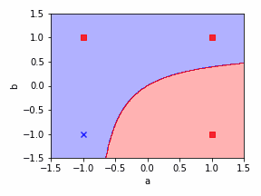
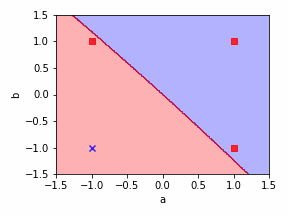
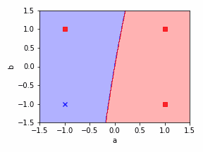
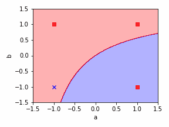
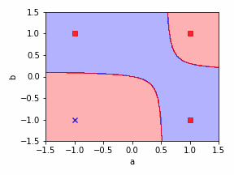
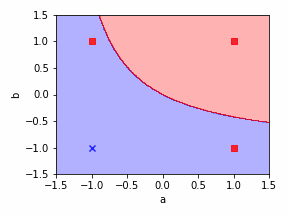

# GateTraining
Experimental research on training the functionality of gate within different of input strategy.

## Single Gate simulation

The purpose of this simulation is to visualize the training process of a certain gate function which is trained in an unbalanced data flow. We simulate a one gate case with mathmatic function:

```
z = w1x1+w2x2+w3x1x2
y = sign(z)
```

Such function do not consider LOW and HIGH function. In the following example, we simulated an OR gate. For 2-input case, 4 data can cover all specifications:

|index|x1 |x2 |y  |
|:---:|---|---|---|
|1    |-1 |-1 |-1 |
|2    |-1 |1  |1  |
|3    |1  |-1 |1  |
|4    |1  |1  |1  |

It is obvious if we use all data for training. The simulation here only use data with `index=1,2,3`. As the `index 4` data is not trained, the functionality will be  easily confused with XOR. We can observe that training only three data via backpropagation cannot ensure the final functionality to be correct for the model regardless of how the initialization of weight is.

We ran 100 independent experiments, where initialization is performed indepentently. The relationship between the success of experiment and whether `index 4` data predicts correctly during initialization can be shown as the following figure:

|initial state|failure|success|
|:-------:|:-------:|:------:|
|`y(x1=1,x2=1) = 1`|7|38|
|`y(x1=1,x2=1) = -1`|53|0|

The result is also affected by the learning rate, but we can still infer that for a success case, the initial state is essensial.

Here show some visualiztion of training process for failure case:






Here show some visualiztion of training process for success case:






# Note

The simulation experiment has an indirect understanding for training a nested network. As the input for each node turned out to be inbalanced, if a previous node shutdown the variaty of value for the next level, it's possible that the later nodes will not get good stimulas, especially when the initial state for those nodes are in an opposite position.

